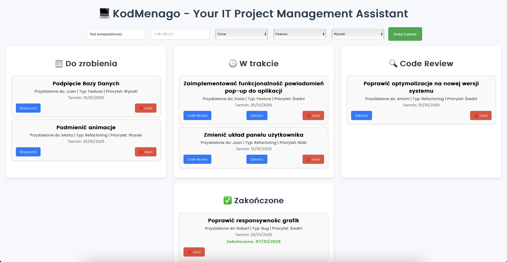
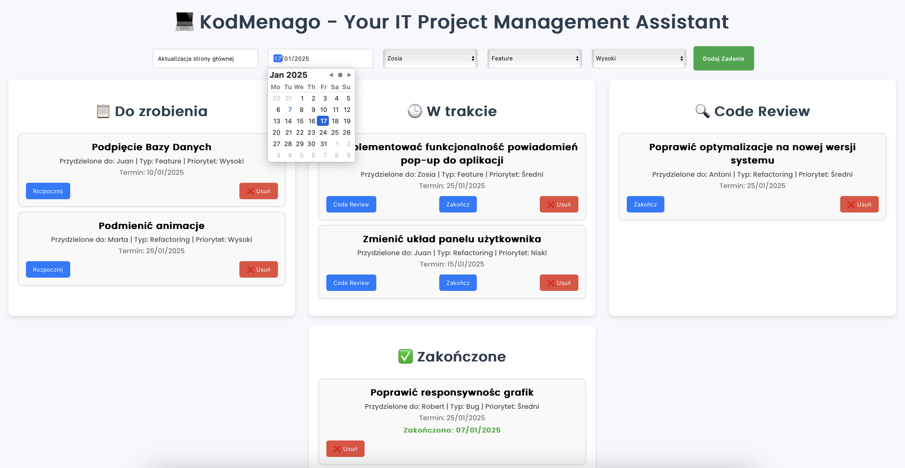

# Coding Team Task Manager "KodMenago"

*** This Project Management App allows teams to manage tasks efficiently and track project progress. Users can create tasks with details such as due date, assignee, type of task (e.g., feature, bug, refactoring), and priority (high, medium, low). Tasks can be moved across different statuses: To Do, In Progress, Code Review, and Done. ***


## KodMenago key features
 
- Dual actions in "In Progress": Tasks can either be sent for code review or marked as done directly.
- Completion Date Tracking: The app records and displays the date when a task is marked as "Done".
- Overdue and approaching deadlines: Tasks approaching their deadline are highlighted in orange, while overdue tasks are shown in  red.
- Task assignment: Tasks can be assigned to specific team members for better collaboration.


This app helps track who is responsible for tasks, what needs to be done, and when it should be completed.

## Installation Guide

1. Clone the repository

```bash
 git clone 
 ```

 2.  Install required dependencies 

 ```bash
 npm install
 ```

 3. Start dev server

```bash
npm start
```

## App Preview





